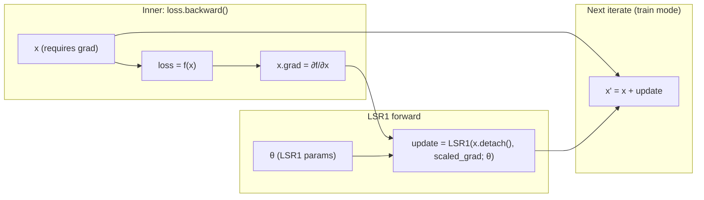
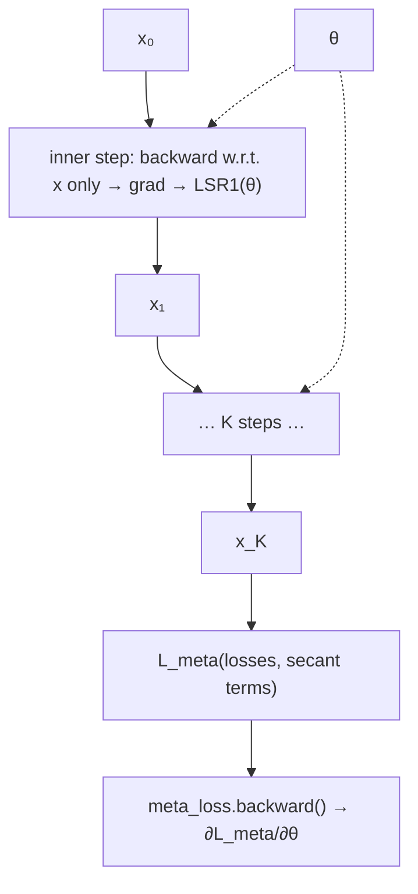

# L-SR1: Learned Symmetric-Rank-One Preconditioning

Official PyTorch code for **L-SR1: Learned Symmetric-Rank-One Preconditioning** (ICML 2026). **Links:** [Project page](https://gallif.github.io/lsr1) · [Paper (arXiv)](https://arxiv.org/abs/2508.12270) · [PDF](https://arxiv.org/pdf/2508.12270.pdf) · ICML proceedings *(currently unavailable)*.

## Citation

If you use this code, please cite the paper:

```bibtex
@misc{lifshitz2025lsr1,
  title         = {{L-SR1}: Learned Symmetric-Rank-One Preconditioning},
  author        = {Lifshitz, Gal and Zuler, Shahar and Fouks, Ori and Raviv, Dan},
  year          = {2025},
  eprint        = {2508.12270},
  archivePrefix = {arXiv},
  primaryClass  = {cs.LG},
  url           = {https://arxiv.org/abs/2508.12270},
}
```

Official ICML proceedings `@inproceedings` citation will be added here when available.

## Overview

**L-SR1** is a learned quasi-Newton optimizer: compact modules build a limited-memory rank-one curvature preconditioner. **PGSM** (Projection-Guided Secant Mechanism) keeps that preconditioner PSD while a secant penalty during meta-training guides it toward quasi-Newton consistency. We evaluate on analytic benchmarks (including performance profiles) and on **monocular human mesh recovery**—AMASS meta-training, 3DPW evaluation without fine-tuning—where L-SR1 improves PA-MPJPE and runtime vs. LGD at matched step budgets.

Motivation, the L-SR1 block diagram, PGSM, analytic results, and HMR curves are on the [**project page**](https://gallif.github.io/lsr1).

## Requirements

- Linux recommended
- NVIDIA GPU with CUDA (environment below uses CUDA 11.7 via conda; see `environment.yaml` for pins)
- [Conda](https://docs.conda.io/) or Mamba

## Setup (environment)

```bash
conda env create -f environment.yaml
conda activate hmr
```

## Standalone `LSR1Optimizer`

The learned symmetric-rank-one update lives in `lsr1/optimizer/`. It expects the same hyperparameter namespace as `model.lsr1` in the Hydra configs (`inner_buffer_size`, `inner_dim`, `alpha1`, `alpha2`, …). Usage pattern: **`reset()`** before a new solve; each step **`backward()`** on your loss, then **`forward(x.detach(), grad.detach())`** and add the returned update to `x` (see `LOPTModel.forward` in `lsr1/models/lsr1_baseline.py`).

A tiny driver (quadratic toy) is in `examples/minimal_lsr1.py`. From the repo root:

```bash
python -m examples.minimal_lsr1
# or:
python examples/minimal_lsr1.py
```

### Meta-training on random quadratics (`examples/meta_random_quad.py`)

A small **meta-learning** loop meta-trains the parameters `θ` of `LSR1Optimizer` on freshly sampled convex quadratics (trajectory loss + optional secant term). From the repo root:

```bash
python -m examples.meta_random_quad --help
```

#### Inner `backward` vs. outer `backward`

Two different autograd roles appear in the training loop:

| Call | What is differentiated? | Role |
|------|-------------------------|------|
| **Inner** `loss.backward()` (per inner step) | `∂(batch objective) / ∂x` at the **current iterate** `x` | Computes the gradient **vector** fed into `LSR1Optimizer`; the objective `loss` is just `f(x)`, so this pass does **not** train `θ`. |
| **Outer** `meta_loss.backward()` (once per meta step) | `∂L_meta / ∂θ` for **LSR1 weights** `θ` | `L_meta` depends on the **unrolled** trajectory (`x_{t+1} = x_t + update_t(θ, …)`), so the graph from `L_meta` back through the inner steps reaches `θ`. |

**One inner step:** here `loss = f(x)` does not involve `θ`, so `loss.backward()` only computes **`∂f/∂x`** (stored in `x.grad`). That gradient is fed into `LSR1Optimizer`; **`update`** depends on **`θ`**, and **`x' = x + update`** links the next iterate to **`θ`** for the *meta* backward pass later.



**Outer meta-step** (where `θ` is actually trained): the meta loss aggregates inner losses (and secant terms) along the chain of updates; **one** `meta_loss.backward()` differentiates through the whole unroll:



**Validation inner loop** in the example (`train_mode=False`): after each step, `x` is **detached** and a fresh leaf is created. Local `loss.backward()` still fills `∂f/∂x` at that step only; the long path that connects iterations for `θ` is cut, which matches using that loop only as a **metric**, not as a meta-loss.

## Human mesh recovery (AMASS / 3DPW)

The following applies to the full **human mesh recovery** pipeline (`train.py` / `eval.py`, Hydra configs, AMASS / 3DPW data).

### Dataset preparation

1. Follow dataset preparation from the [Learned Gradient Descent](https://github.com/InpatientJam/Learned-Gradient-Descent) repository where applicable.
2. Use the preprocessing scripts in `scripts/` if you need to build AMASS / 3DPW caches in this codebase’s format:
   - `scripts/preprocess_AMASS.py`
   - `scripts/preprocess_3DPW.py`

Set `dataset_root` to a directory that contains (after preprocessing):

| File | Used by |
|------|---------|
| `AMASS.npz` | Training |
| `3DPW_valid.npz` | Validation during training |
| `3DPW_test.npz` | Evaluation |

Paths are configured in `configs/train.yaml` and `configs/eval.yaml` via `dataset_root`.

### Pretrained weights (evaluation)

The released checkpoint is included in this repository:

`checkpoints/lsr1__l4__best-model.ckpt` (~59&nbsp;MB)

Use it with `load_checkpoint` (see below). For other experiments, training still writes checkpoints under each Hydra run directory (`ckpts/`).

### Training (AMASS)

Runs with Hydra; checkpoints are written under the Hydra run directory (see `configs/train.yaml` for `hydra.run.dir`).

```bash
python train.py dataset_root=/path/to/data/dir
```

Optional overrides, e.g. GPU index:

```bash
python train.py dataset_root=/path/to/data/dir cuda_devices=0
```

### Evaluation (3DPW)

```bash
python eval.py \
  load_checkpoint=checkpoints/lsr1__l4__best-model.ckpt \
  dataset_root=/path/to/data/dir
```

**Weights and biases:** Training and evaluation use `WandbLogger` if configured in code; set up [Weights & Biases](https://wandb.ai/) or adjust loggers in `train.py` / `eval.py` for offline/desired behavior.

## Repository layout

```
configs/          # Hydra configs (train / eval)
checkpoints/      # Released eval weights (lsr1__l4__best-model.ckpt)
examples/         # minimal_lsr1.py, meta_random_quad.py — toy / meta-training demos
lsr1/
  optimizer/      # L-SR1 algorithm (LSR1Optimizer)
  data/           # Dataset loaders
  models/         # LOPTModel (HMR + inner L-SR1 loops)
  utils/          # SMPL, losses, camera, …
scripts/          # AMASS / 3DPW preprocessing
train.py
eval.py
```

## License

This project is licensed under the MIT License — see [LICENSE](LICENSE).
